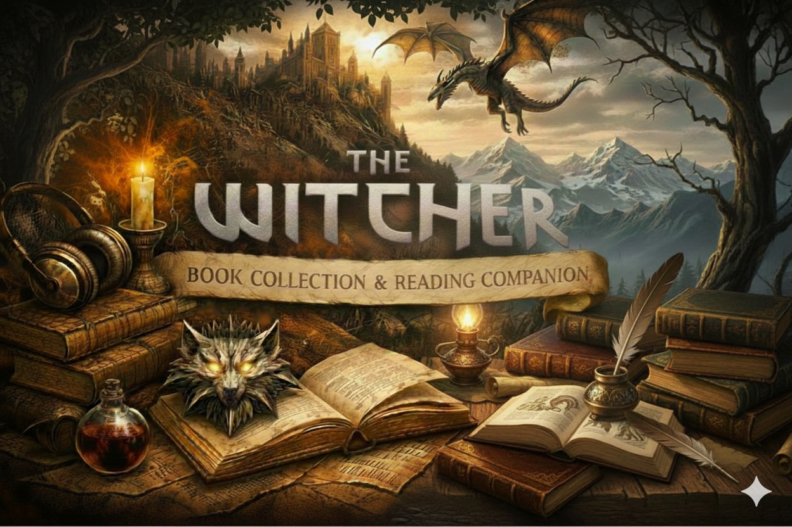

# The Witcher – Book Collection & Reading Companion

  

This repository is essentially me geeking out over *The Witcher* book series. It serves as a collection of content aimed at making *The Witcher* freely accessible and at offering extras that make the reading experience more enjoyable.

The core of this repository consists of all The Witcher books. These are available both as e-books (EPUB format) and as audiobooks (MP3 format), in **sections 1 and 2** respectively.

If you want a very quick refresher on what has happened so far, you can consult the summaries in **section 3**. These describe the main events of each chapter in roughly three sentences per chapter.

When I read books, I often find it difficult to keep track of who is who, especially in large fantasy worlds such as that of The Witcher. I think this is partly because I struggle to form a clear mental image of each character’s face and appearance. To address this, I created **section 4**, which includes spoiler-free portraits of the main characters. These portraits are as faithful as possible to the book descriptions, and are not based on the games or the Netflix series.

I find it a shame that adult books rarely include illustrations. There is a lot of excellent fan art that stays true to the books and is enjoyable to view while reading. After finishing a chapter, I like to treat myself to illustrations depicting the events I have just read about. Searching for this kind of content online takes effort and often exposes you to spoilers. That is why I am creating **section 5** for your, and my, pleasure and convenience. This section contains book-accurate illustrations of the events of each chapter, allowing you to experience The Witcher books as if they were fully illustrated.

I started by collecting and ordering all of Denis Gordeev’s illustrations, the classic black-and-white ones, and I plan to add many more from a wide range of sources. This is a lot of work and will remain a work in progress, probably forever. If you would like to help, please open an issue on GitHub.

Please enjoy the world of The Witcher, and feel free to share this repository with others.